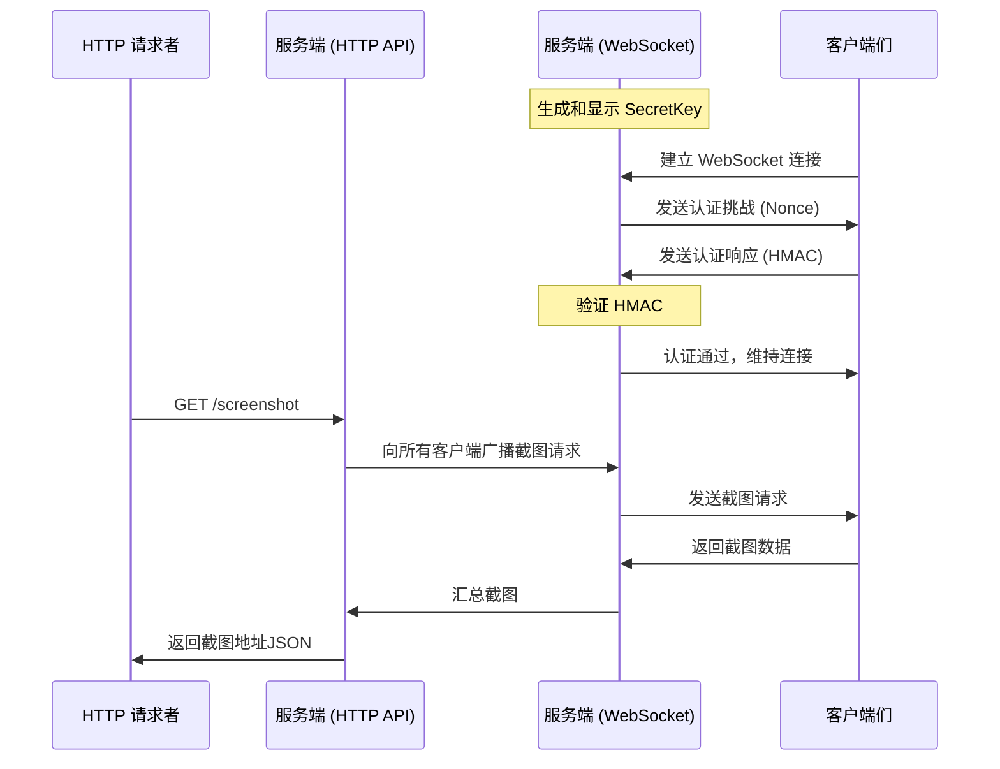

# RemoShot

远程实时截图工具。由服务端（CLI）和客户端（Windows / macOS 托盘应用）组成。

## 架构



## 构建

```bash
# 构建所有组件
cargo build --release

# 仅构建服务端
cargo build --release -p remoshot-server

# 仅构建客户端
cargo build --release -p remoshot-client
```

## 使用

### 服务端

启动服务端时，会生成并显示一个 **SecretKey**（如不存在），这个密钥用于客户端认证。请妥善保管此密钥。

```bash
# 通过命令行参数指定所有配置
remoshot-server --ws-port 8283 --http-addr 127.0.0.1:8113 --retention 30

# 不带参数启动，将交互式询问配置
remoshot-server
```

启动后，服务端会在日志中显示 SecretKey：

```
INFO remoshot_server: Server SecretKey: abc123def456...
```

参数说明：

- `--ws-port` — WebSocket 监听端口（客户端连接用），如 `8283`
- `--http-addr` — HTTP API 监听地址，如 `127.0.0.1:8113`
- `--retention` — 截图保留时间（分钟），过期后自动清理

### 客户端

直接运行 `remoshot-client`。首次启动时弹出设置窗口，配置：

- **Server address** — 服务端 WebSocket 地址，如 `ws://your-server:8283/ws`
- **Machine name** — 本机名称，用于标识截图来源
- **Secret key** — 服务端启动时显示的认证密钥

之后客户端常驻系统托盘（无主窗口、无控制台），右键托盘图标可以：

- **Settings** — 重新打开设置窗口
- **View Logs** — 查看运行日志（最近 500 条）
- **Quit** — 退出程序

### 截图 API

发起截图请求：

```bash
curl http://127.0.0.1:8113/screenshot
```

返回 JSON：

```json
{
    "deviceA": ["/images/xxx_deviceA_0_1234567890.jpg"],
    "deviceB": ["/images/xxx_deviceB_0_1234567890.jpg", "/images/xxx_deviceB_1_1234567890.jpg"]
}
```

访问截图：

```bash
curl http://127.0.0.1:8113/images/xxx_deviceA_0_1234567890.jpg -o screenshot.jpg
```

### 使用 systemd 保活服务端

```ini
# /etc/systemd/system/remoshot.service
[Unit]
Description=RemoShot Server
After=network.target

[Service]
Type=simple
ExecStart=/path/to/remoshot-server --ws-port 8283 --http-addr 127.0.0.1:8113 --retention 30
WorkingDirectory=/path/to/remoshot-data
Restart=always
RestartSec=5

[Install]
WantedBy=multi-user.target
```

```bash
sudo systemctl daemon-reload
sudo systemctl enable --now remoshot
```

## Nginx 反向代理配置

以下配置将 HTTP/WS 连接转为 HTTPS/WSS，提供安全访问。

```nginx
# /etc/nginx/conf.d/remoshot.conf

# HTTP API（截图请求 + 图片服务）
server {
    listen 443 ssl http2;
    server_name remoshot.example.com;

    ssl_certificate     /etc/ssl/certs/remoshot.example.com.pem;
    ssl_certificate_key /etc/ssl/private/remoshot.example.com.key;

    # 截图 API 和图片服务
    location / {
        proxy_pass http://127.0.0.1:8113;
        proxy_set_header Host $host;
        proxy_set_header X-Real-IP $remote_addr;
        proxy_set_header X-Forwarded-For $proxy_add_x_forwarded_for;
        proxy_set_header X-Forwarded-Proto $scheme;
    }
}

# WebSocket 代理（客户端连接）
server {
    listen 443 ssl http2;
    server_name ws.remoshot.example.com;

    ssl_certificate     /etc/ssl/certs/remoshot.example.com.pem;
    ssl_certificate_key /etc/ssl/private/remoshot.example.com.key;

    location /ws {
        proxy_pass http://127.0.0.1:8283;
        proxy_http_version 1.1;
        proxy_set_header Upgrade $http_upgrade;
        proxy_set_header Connection "upgrade";
        proxy_set_header Host $host;
        proxy_set_header X-Real-IP $remote_addr;
        proxy_set_header X-Forwarded-For $proxy_add_x_forwarded_for;
        proxy_set_header X-Forwarded-Proto $scheme;
        proxy_read_timeout 86400;
        proxy_send_timeout 86400;
    }
}

# HTTP → HTTPS 重定向
server {
    listen 80;
    server_name remoshot.example.com ws.remoshot.example.com;
    return 301 https://$host$request_uri;
}
```

使用 WSS 时，客户端地址应填写 `wss://ws.remoshot.example.com/ws`。

## 许可证

MIT
